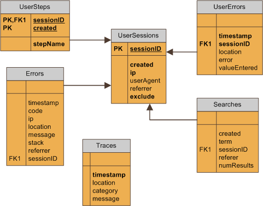

# Logging

Logs user actions, exceptions and traces easily, tailored specifically for web applications.

* [Logging in action](#inaction)
* [Setting it up](#setup)
* [Analyzing the data](#analyze)
* [Database model](#db)
* [FAQ](#faq)

## {anchor:inaction}Logging in action

### Log errors

Log errors encountered during an execution of code. There are 4 overloads available, depending on the variables available during execution.

Page URL, referring URL are recorded automatically if an instance of **HttpContext** is used. Stack trace is recorded automatically if an instance of **Exception** is used.

{code:c#}
void Page_Load(object sender, EventArgs e)
{
	Logging.LogError("test page", "test error");	
	Logging.LogError(Context, "test error");
	
	try
	{
		DoSomethingThatMayRaiseAnException();
	}
	catch (Exception ex)
	{
		Logging.LogError(Context, ex);
		Logging.LogError("test page", ex);
	}
}
{code:c#}

You can also catch all exceptions in the _Global.asax_ file:

{code:c#}
void Application_Error(object sender, EventArgs e)
{
	Logging.LogError(Context, Context.Error);
}
{code:c#}

### Log search

Logs the search term used, the number of results, and the page the search was performed at.

{code:c#}
void SearchButton_Click(object sender, EventArgs e)
{
	var searchTerm = SearchTermTextBox.Text;
	var searchResults = SearchEngine.Search(SearchTerm);
	
	LogSearch(searchTerm, searchResults.Count, Context);
}
{code:c#}

### Log new sessions

Logs any sessions that were created. Properties recorded are session ID, date/time created, IP address, user agent string, referring URL, and whether this session should be marked as "exclude".

Global.asax
{code:c#}
void Session_Start(object sender, EventArgs e)
{
	Logging.LogSessionCreate(Context);
}
{code:c#}

### Log user errors

Track which form fields users have the most problems with an what values they entered in them. This helps you improve the usability of input forms on your website.

{code:c#}
void SubmitFormButton_Click(object sender, EventArgs e)
{
	var errorsAndValues = new Dictionary<string, string>;
	
	if (string.IsNullOrEmpty(TextBox1.Text))
		errorsAndValues.Add("TextBox1-Empty", null);
	if (!StringFormat.IsInteger(TextBox1.Text))
		errorsAndValues.Add("TextBox1-InvalidNumber", TextBox1.Text);
		
	Logging.LogUserErrors("Checkout Page", errorsAndValues);
}
{code:c#}

### Log user steps

Keep track of what user did at what time.

{code:c#}
void Page_Load(object sender, EventArgs e)
{
	Logging.LogUserStep(Context, "Homepage");
}
{code:c#}

### Tracing

Records variable values of your choosing to aid debugging.

{code:c#}
void Page_Load(object sender ,EventArgs e)
{
	var result = MysteriousClass.GetResult();
	
	// record the mysterious value to ensure that you are getting the
	// result you're expecting
	Logging.Trace(result.MysteriousValue.ToString(), "MysteriousClass");
	
	// note the location of this trace for more specific information
	Logging.Trace(result.MysteriousValue.ToString(), "MysteriousClass",
		"Checkout");
}
{code:c#}

## {anchor:setup}Setting it up

**Step 1: Prepare the database.** Execute the following command in your command prompt to prepare the database tables in MySQL:

{code:powershell}
mysql MyDatabase < Setup\MySQL\SetupLog.sql
{code:powershel}

**Step 2: Add a connection string**  called "SharpNick.LogConnection" into web.config:

{code:xml}
<configuration>
	<connectionStrings>
		<add name="SharpNick.LogConnection"
			connectionString="Database=DatabaseName;DataSource=ServerIP"
			providerName="MySql.Data.MySqlClient" />
	</connectionStrings>
</configuration>
{code:xml}

**Step 3: _(Optional)_ Set up the exclusion cookie.** If you're using web analytics solutions like [Google Analytics](http://www.google.com/support/analytics/bin/answer.py?hl=en&answer=55481), you can mark sessions as excluded based on a cookie's value.

The sessions will still recorded, but can be excluded based on the value of the "exclude" field in each record.

See [configuration reference](SharpNickConfiguration) to use the <sharpNick> node.

{code:xml}
<sharpNick>
	<logging>
		<excludeCookie name="__utmv" value="exclude" />
	</logging>
</sharpNick>
{code:xml}

## {anchor:analyze}Analyzing log data

Here are a couple of (My)SQL queries that you can perform:

**Errors:** Get the list of errors encountered this month, the number of errors so far, the last time this has happened, the error message, and the stack trace:

{code:sql}
SELECT max(timeStamp) as latest, count(*) AS num, message,
	stack, location, max(length(referrer))
FROM Errors
WHERE MONTH(timeStamp)=month(now()) AND YEAR(timeStamp)=year(now())
GROUP BY message, stack
ORDER BY latest DESC
{code:sql}

**User errors:** Get a list of user errors and an example of their values for the most problematic form fields on the page named "Checkout":

{code:sql}
SELECT count(*) AS num, error, valueEntered
FROM UserErrors
WHERE location='Checkout'
GROUP BY error
ORDER BY num DESC
{code:sql}

## {anchor:db}Database model

## {anchor:faq}FAQ

**Why not use log4net?**

log4net is extremely flexible. However, its flexibility makes configuration and debugging of the logging system itself difficult.

SharpNick.Logging aims to make logging on ASP.NET applications easy to understand and use. All you have to do to start using it is to set up the database and add one line of code into your web.config file.

SharpNick.Logging automatically extracts useful information from the _HttpContext_ instance to make debugging of ASP.NET applications easier.

**Does it support MySQL only?**

It is built and tested to work with MySQL for now. Support for other databases has not been implemented, but theoretically can be expanded to use other databases - so long as the database driver supports DbConnectionFactory.

**Why not file-based storage instead of databases?**

Storing log data in a database makes error analysis easier. Not all errors that occured in a web application can be addressed - bots are known to hack URLs - and we need to prioritize which errors to address. Datamining with SQL is easier than looking through thousands of lines in Notepad.

**How can I debug the logging system if it swallows all exceptions?**

Specify _throwExceptions="true"_ in the <sharpNick> [configuration node](SharpNickConfiguration):

{code:xml}
<sharpNick>
	<logging throwExceptions="true" />
</sharpNick>
{code:xml}